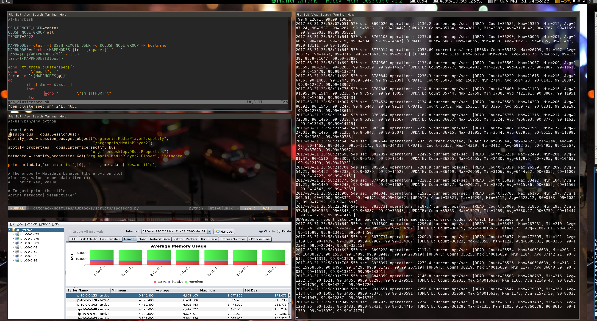
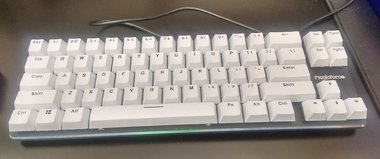
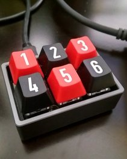

## My dotfiles collection

This is a set of configuration files that I use for my X desktop, an Ubuntu 16.04 machine. The all-star cast of
characters includes:

* i3 tiling window manager (the [i3-gaps fork](https://github.com/Airblader/i3))
* [i3-blocks](https://github.com/vivien/i3blocks) for status
* [font-awesome](http://fontawesome.io) for icons
* [compton](http://lubuntu.me/meet-compton/) for composing windows
* [variety](http://peterlevi.com/variety/how-to-install/) for backgrounds
* [gnome-terminal](https://git.gnome.org/browse/gnome-terminal/) for a terminal emulator
* [gruvbox](https://github.com/morhetz/gruvbox) color scheme for Vim (also available for [i3](https://github.com/acrisci/i3-style))
* [spotify](http://spotify.com), of course
* [workrave](http://www.workrave.org/) to stand up every once in a while
* [hack](https://github.com/chrissimpkins/Hack) and [Ohsnap](https://sourceforge.net/projects/osnapfont/) fonts for terminal and status, respectively
* [vundle](https://github.com/VundleVim/Vundle.vim) plugins:  [airline](https://github.com/vim-airline/vim-airline), [nerdtree](https://github.com/scrooloose/nerdtree), [jedi-vim](https://github.com/davidhalter/jedi-vim)
* [vimium](https://vimium.github.io/) for chrome

## Screenshot

## Hardware

My current war wagon is a custom [Magicforce 68](https://www.aliexpress.com/store/product/Balck-white-68-Key-PBT-compact-mini-mechanical-keyboard-kailh-mx-switches-game-Magicforce-68-mini/1806079_32471875698.html) with Gateron blacks and some [RK doubleshot ABS keys](https://www.massdrop.com/buy/royal-kludge-doubleshot-abs-keycaps).

and its sidekick, a [SixKeyBoard](https://techkeys.us/collections/keyboards/products/sixkeyboard) (with Cherry MX Blues) that I use for macros and various things.

